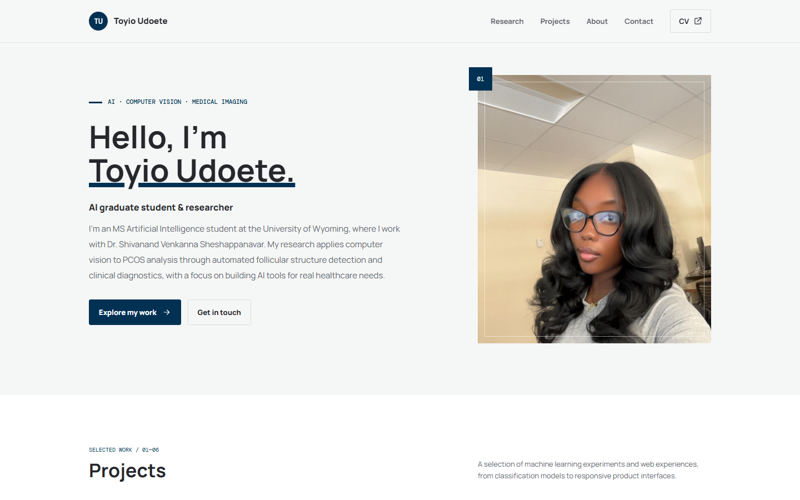

# Toyiomfon Udoete | Portfolio

Personal portfolio for my work in artificial intelligence, computer vision, medical imaging, and web development.

## Contents

- `index.html` - responsive portfolio page
- `assets/images/` - portrait, project thumbnails, favicon, and other site images
- `assets/documents/` - current resume and project report
- `screenshots/` - screenshots of the published site
- `google351e3b7d14eca5f9.html` - Google site verification
- `robots.txt` and `sitemap.xml` - search engine metadata

## Preview locally

Open `index.html` in a browser. The page is static and does not require a build step or package installation.

## Deployment

The site is published with GitHub Pages from the `main` branch:

https://toyioudoete.github.io/myPortfolio/